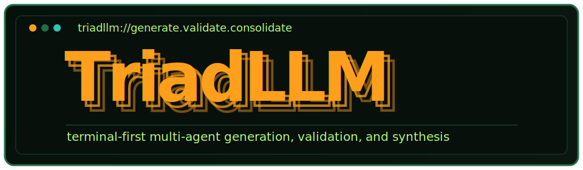
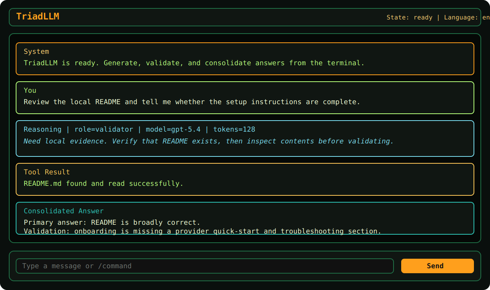

# TriadLLM

<p align="center">
  
</p>

[](https://www.python.org/)
[](https://github.com/ibitato/TriadLLM/actions/workflows/ci.yml)
[](https://textual.textualize.io/)
[](./docs/PROVIDERS.md)
[](./LICENSE)

`TriadLLM` is a terminal chat application for multi-stage LLM work.

Each user turn follows a fixed workflow:

1. `processor` generates the primary answer
2. `validator` checks that answer against the original request and gathered evidence
3. `orchestrator` consolidates both into the final user-facing reply

The repository language is English, and fresh installs default to English in the app. Spanish is also supported at runtime with `/lang es`.

## Preview



## What TriadLLM Is

TriadLLM is not a "two independent opinions" system.

The intended workflow is:

- generate a primary answer
- validate it against the original request
- consolidate the answer and validation into a final response

That makes the second model a grounded review layer rather than a second parallel solver.

## Features

- scrollable transcript with fixed bottom composer
- retro ASCII splash screen on startup, dismissed by any key or after 5 seconds
- two-line composer with `Enter` to send, `Ctrl+J` for a newline, and `Ctrl+E` for an expanded editor
- FIFO turn queue when new prompts are submitted while another turn is running
- cancel button and `/cancel` support for the active turn
- proposal, validation, and consolidation pipeline
- full visible conversation history passed back to agents on each turn
- clarification loop when the processor or validator needs more data
- local tools with permission prompts
- toggleable reasoning display with `/reasoning on|off`
- toggleable tool request/result display with `/toolresults on|off`
- slash commands for runtime control
- JSONL session persistence
- structured rotating logs
- English and Spanish locales
- Python `3.13` environment managed with `uv`
- official OpenAI and Mistral SDKs where possible
- OpenAI-compatible local backend support

## Quick Start

### 1. Install `uv`

See the official installer:

https://docs.astral.sh/uv/getting-started/installation/

### 2. Clone and bootstrap

```bash
git clone https://github.com/ibitato/TriadLLM.git
cd TriadLLM
uv python install 3.13
uv sync
```

### 3. Prepare provider configuration

Run the app once to create the local config directories:

```bash
uv run triad
```

Then copy the example profile file into your user config directory.

Typical locations:

- Linux: `~/.config/TriadLLM/profiles.yaml`
- macOS: `~/Library/Application Support/TriadLLM/profiles.yaml`
- Windows: `%APPDATA%\\TriadLLM\\profiles.yaml`

Example on Linux:

```bash
mkdir -p ~/.config/TriadLLM
cp src/triadllm/examples/profiles.yaml ~/.config/TriadLLM/profiles.yaml
```

### 4. Export API keys

Examples:

```bash
export OPENAI_API_KEY=...
export MISTRAL_API_KEY=...
```

TriadLLM reads credentials from the shell environment. It does not auto-load `.env`.

### 5. Start the app

```bash
uv run triad
```

Alternative entrypoint:

```bash
uv run triadllm
```

## Composer Controls

- `Enter` sends the current draft
- `Ctrl+J` inserts a newline in the bottom composer
- `Ctrl+E` opens the expanded composer modal
- inside the expanded composer, `Ctrl+S` sends and `Esc` cancels
- if a turn is already running, new non-command prompts are queued automatically
- the `Cancel` button or `/cancel` stops the active turn and allows the queue to continue

## Fastest First Working Setup

If you want the shortest path to a first successful run:

1. copy the example `profiles.yaml`
2. export `OPENAI_API_KEY`
3. keep the example `default_profile: openai_default`
4. launch `uv run triad`

That runs all three roles through the same OpenAI profile until you decide to split roles across different providers.

## First-Run Checklist

After cloning the repo, verify:

- Python `3.13` is installed with `uv`
- `uv sync` completed successfully
- `profiles.yaml` exists in the user config directory
- the required API keys are exported in the shell
- `uv run triad` starts the TUI
- `/models` shows the configured profiles
- `/status` shows the expected language, permissions, and log path

## Configuration and Runtime Files

TriadLLM stores runtime state outside the repo:

- `settings.json`: language, permission mode, log settings, UI toggles, role assignments
- `profiles.yaml`: provider/model definitions
- `sessions/*.jsonl`: persisted session events
- `triadllm.log`: structured runtime log

On first launch, TriadLLM automatically reuses legacy local config from `MultiBrainLLM` if it finds existing settings, profiles, sessions, or logs.

Repository examples:

- sample profiles: [`src/triadllm/examples/profiles.yaml`](./src/triadllm/examples/profiles.yaml)
- sample settings: [`src/triadllm/examples/settings.json`](./src/triadllm/examples/settings.json)

## Tools and Permissions

Available local tools:

- `shell_exec`
- `read_file`
- `write_file`
- `list_dir`
- `search_files`
- `get_env`
- `pwd`

Execution modes:

- `ask`: every tool request requires approval
- `yolo`: tool requests run immediately

Use `/permissions ask` or `/permissions yolo` to switch modes at runtime.

## Slash Commands

- `/help`
- `/status`
- `/config`
- `/permissions ask|yolo`
- `/lang es|en`
- `/models`
- `/model set <orchestrator|processor|validator> <profile>`
- `/tools`
- `/reasoning on|off`
- `/toolresults on|off`
- `/new`
- `/clear`
- `/quit`

## Documentation

- installation guide: [`docs/INSTALLATION.md`](./docs/INSTALLATION.md)
- configuration reference: [`docs/CONFIGURATION.md`](./docs/CONFIGURATION.md)
- provider setup examples: [`docs/PROVIDERS.md`](./docs/PROVIDERS.md)
- architecture guide: [`docs/ARCHITECTURE.md`](./docs/ARCHITECTURE.md)
- troubleshooting guide: [`docs/TROUBLESHOOTING.md`](./docs/TROUBLESHOOTING.md)
- FAQ: [`docs/FAQ.md`](./docs/FAQ.md)
- public launch checklist: [`docs/PUBLIC_REPO_CHECKLIST.md`](./docs/PUBLIC_REPO_CHECKLIST.md)
- roadmap: [`ROADMAP.md`](./ROADMAP.md)
- changelog: [`CHANGELOG.md`](./CHANGELOG.md)
- release process: [`docs/RELEASING.md`](./docs/RELEASING.md)
- contributing guide: [`CONTRIBUTING.md`](./CONTRIBUTING.md)
- code of conduct: [`CODE_OF_CONDUCT.md`](./CODE_OF_CONDUCT.md)
- security policy: [`SECURITY.md`](./SECURITY.md)
- support guide: [`SUPPORT.md`](./SUPPORT.md)
- coding-agent maintenance guide: [`AGENTS.md`](./AGENTS.md)

## Development

```bash
uv sync --dev
uv run pytest -q
uv run python -m compileall src tests docs
uv build
```

## License

This project is source-available under `PolyForm Noncommercial 1.0.0`. Commercial use is not allowed without separate permission.
